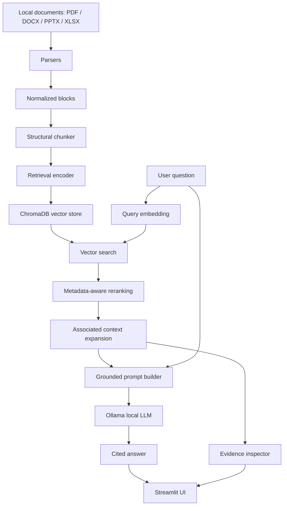

# Pharma Copilot

Pharma Copilot is a local-first Retrieval-Augmented Generation (RAG) application for asking questions over pharma, enterprise, and analytics documentation. It ingests local documents, creates structure-aware chunks, embeds them, stores them in ChromaDB, retrieves relevant and associated context, and generates grounded answers through a local Ollama model.

The project is intentionally built from core components so the ingestion, chunking, embedding, retrieval, and answer-generation mechanics are visible and testable.

## Current Status

Implemented:

- Local document ingestion for PDF, DOCX, PPTX, and XLSX files.
- Text normalization and parser-specific metadata preservation.
- Structure-aware chunking with section metadata and overlap.
- Sentence Transformers embedding generation.
- Persistent ChromaDB vector storage.
- Metadata-aware reranking for retrieval results.
- Associated-context expansion for same-section and nearby chunks.
- Streamlit UI for asking questions and inspecting evidence.
- Ollama-backed local answer generation with citations.
- Streaming answer display with a progress bar.
- Retrieval JSON export.
- Unit tests for parsers, chunking, embeddings, Chroma storage, retrieval, and answering.

Not yet implemented:

- File upload ingestion from the UI.
- Chat history and multi-turn memory.
- Evaluation dashboard and benchmark scoring.
- Hybrid keyword plus vector retrieval.
- Query rewriting and routing.
- LangGraph orchestration.
- Authentication, document versioning, and enterprise deployment features.

See [roadmap.md](roadmap.md) for implemented features and planned future work.

## Architecture



## Repository Layout

```text
app/
  streamlit_app.py          Streamlit RAG UI
  ollama_test.py            Minimal Ollama connectivity test
chunkers/
  structural_chunker.py     Section-aware chunking
models/
  answering.py              Prompt builder and Ollama adapter
  chroma_store.py           ChromaDB persistence
  retrieval_encoder.py      Sentence Transformers embedding generation
  retriever.py              Chroma retrieval, reranking, associated context
parsers/
  docx_parser.py            DOCX block parser
  pdf_parser.py             PDF block parser
  ppt_parser.py             PPTX block parser
  xlsx_parser.py            XLSX block parser
runners/
  run_ingestion.py          Parse sample documents
  run_structural_chunker.py Create chunks
  run_retrieval_encoder.py  Generate embeddings
  run_chroma_store.py       Persist embeddings to ChromaDB
  run_retriever.py          CLI retrieval debug tool
tests/
  test_*.py                 Unit tests for pipeline components
outputs/
  *.json                    Generated pipeline artifacts
```

## Requirements

- Python 3.12+
- `uv`
- Ollama installed and running locally
- A pulled Ollama model, for example:

```powershell
ollama pull llama3.2:3b
```

Project dependencies are managed in [pyproject.toml](pyproject.toml).

## Quick Start

Install dependencies:

```powershell
uv sync
```

Run the Streamlit app:

```powershell
uv run streamlit run app\streamlit_app.py
```

Open:

```text
http://localhost:8501
```

The UI uses:

- Chroma path: `outputs/chroma_db`
- Chroma collection: `pharma_copilot_chunks`
- Ollama model: `llama3.2:3b`

You can change the Chroma path, collection, Ollama model, host, temperature, and context window in the sidebar.

## Full Local Pipeline

Use this sequence when rebuilding the document index from local sample documents.

1. Put supported files under:

```text
data/sample_docs/
```

2. Parse documents:

```powershell
uv run python runners\run_ingestion.py
```

3. Create structure-aware chunks:

```powershell
uv run python runners\run_structural_chunker.py
```

4. Generate retrieval embeddings:

```powershell
uv run python runners\run_retrieval_encoder.py
```

5. Store embeddings in ChromaDB:

```powershell
uv run python runners\run_chroma_store.py --reset
```

6. Start the UI:

```powershell
uv run streamlit run app\streamlit_app.py
```

## CLI Retrieval Debugging

Run a retrieval-only query from the terminal:

```powershell
uv run python runners\run_retriever.py "What are the out of scope items?" --debug
```

Useful options:

- `--top-k`: final reranked chunks returned by the CLI.
- `--candidate-k`: vector candidates fetched before reranking.
- `--text-only`: print only chunk text.
- `--model`: override the query embedding model.

The Streamlit app intentionally hides these retrieval knobs and uses an internal policy that fetches broad semantic candidates, reranks them, and expands associated context automatically.

## Streamlit UI

The UI provides:

- A single `Answer question` action.
- Automatic ChromaDB retrieval before answer generation.
- Associated context expansion for same-section and nearby chunks.
- Ollama streaming answer generation.
- A 0 to 100 progress bar while the answer is generated.
- Evidence metrics for context chunks, best matches, associated context, and embedding model.
- Retrieved chunk inspection with metadata and reranking details.
- Grounded prompt inspection.
- JSON export of query, answer, prompt, and retrieved evidence.

Streamlit file watching is disabled in [.streamlit/config.toml](.streamlit/config.toml). This avoids noisy optional `torchvision` import errors caused when Streamlit scans lazy `transformers` vision modules. Restart Streamlit after code changes.

## Ollama Smoke Test

You can test Ollama independently:

```powershell
uv run python app\ollama_test.py
```

Expected behavior: the script prints an Ollama response object from `llama3.2:3b`.

## Testing

Run the focused tests used during development:

```powershell
uv run pytest tests\test_answering.py tests\test_retriever.py
```

Run the full test suite:

```powershell
uv run pytest
```

Compile key app files:

```powershell
uv run python -m py_compile app\streamlit_app.py models\answering.py models\retriever.py
```

## Design Notes

- The embedding model used for queries is inferred from Chroma metadata in the UI.
- Answer generation uses retrieved chunks as factual evidence; Ollama is used to synthesize, organize, and explain.
- The prompt places retrieved context before the question.
- The retriever adds same-section and nearby chunks so the LLM receives more complete context than a simple top-k result list.
- The UI does not expose low-level retrieval tuning to keep the product workflow simple.

## Roadmap

Future work is tracked in [roadmap.md](roadmap.md).
